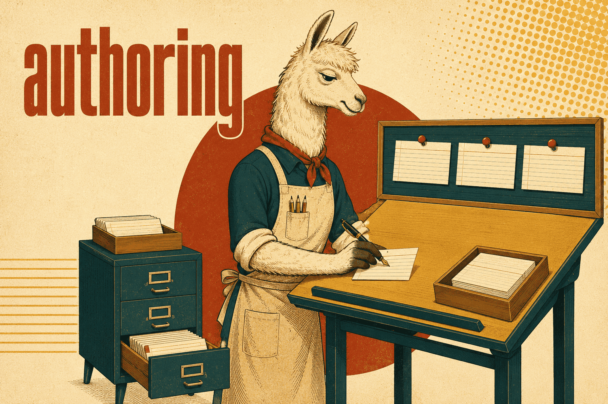

# Skills about skills

The meta group: writing skills, getting their content out of code that already
exists, keeping them lean, the library's own ownership rules, and the agent setup
that consumes them. This is what turns the repo into a workbench for skill editing
rather than just a shelf.

Working on a skill usually means two of these at once — `getty-skill-library`
answers where it lives and what it is called, `skill-authoring` answers what goes
inside.

## [skill-authoring](skill-authoring/SKILL.md)

How to write a SKILL.md that actually fires and actually gets followed. A skill's
`description` is always in the agent's context and the body only loads when the
description matches — so the two follow different rules, and the most common failure
is a description that summarises the workflow instead of naming its triggers (the
agent then follows the summary and skips the body).

Covers the four archetypes (reference, convention, workflow, concept) with a
structure and quality bar for each, description rules, body rules — progressive
disclosure, positive phrasing, matching the form of a rule to the way it fails —
and how to test: baseline with a fresh subagent *without* the skill to prove the
failure is real, then verify with it.

**Load when** writing or reworking a SKILL.md, before the first line. Also when a
skill misfires: never triggers, fires on the wrong tasks, or is read and ignored.

## [skill-mining](skill-mining/SKILL.md)

Turns settled decisions that live only in a codebase into skill content — the
antidote to a skill full of invented conventions that nobody actually follows.

The run is deliberate: declare a corpus of hand-written code (AI-written code is
not evidence of a house rule), read it for candidates, count **both** sides of every
candidate so a 3-vs-2 split is not sold as canon, check the decision axes for the
ones the code is silent about, subtract what the skills already say, then present
everything in a verdict file where a human writes `yes`, `no`, or free text. Only
approved candidates land — rejected ones stay on record so a later run does not
propose them again.

**Load when** a skill's content should come from existing code, or when checking
whether a skill states real practice or something an agent made up.

## [skill-compressor](skill-compressor/SKILL.md)

Converts verbose skills into compact ones with the same behaviour: extract the
execution rules, never merely shorten the prose.

Carries a retention priority (hard constraints and "never" rules first, motivation
and filler last), a classification for project-specific references — essential,
parameter, example, noise — and a hard rule for code: compress *around* examples,
never inside them. Mangled example code teaches fake syntax, which is far more
expensive than the tokens it saves. Names and descriptions of existing skills are
left alone, because a rename breaks every `briefing.skills` list referring to it.

**Load when** a skill, prompt or instruction file must shrink — compressing one,
merging overlapping ones, cutting token cost, or generalising a project-bound skill
for reuse.

## [getty-skill-library](getty-skill-library/SKILL.md)

The library's own constitution: a skill lives in the repo that owns its subject, and
only knowledge a *second, unrelated* project needs gets promoted here.

Defines the naming scheme and the `getty-` prefix semantics (prescribes vs.
reference), and — most importantly — the editing discipline. Skill files are
hardlinked across repos, so every copy is the same inode. Tools that replace a file
on write detach it, and every other project silently keeps the old content. The fix
is an in-place truncating write plus a verified inode and link count.

**Load when** adding, naming, moving or renaming a skill, linking one into a repo
with manage-skills, or before editing any hardlinked SKILL.md.

## [getty-agent-team](getty-agent-team/SKILL.md)

Installs a whole multi-agent setup into a project: subagents whose skills are
force-loaded at spawn time by the [briefing](https://github.com/Getty/briefing)
plugin, a house-rules file carrying engineering discipline and the delegation lock,
and the skill base those agents are briefed from.

The order matters and the skill enforces it — the skill base is settled *first*,
because briefing hard-fails a spawn when a declared skill name does not resolve.
Ships role templates (worker, test-writer, release-checker, doc-writer,
karr-coordinator) and an audit mode for bringing an existing, drifted setup back in
line. Coordination via [karr](https://github.com/Getty/karr) is a documented
optional layer.

**Load when** a repo needs subagents, or when `.claude/agents` is missing or has
drifted. Runs user-level only — never hardlink this one into a project.
