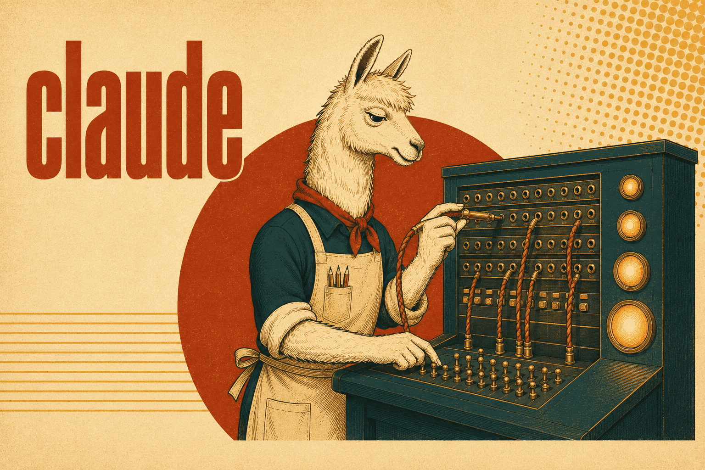

# Claude skills

Working with Claude itself: spawning another instance of it, talking to the
sessions already running, and deciding which model any given piece of work should
run on. All three are reference skills — nothing here is specific to one project.

## [claude-headless](claude-headless/SKILL.md)

`claude -p` runs one non-interactive turn-loop and exits, and calling it from
inside a running session works without any environment cleanup. What bites is
everything around that: a child does **not** inherit the parent's model (it reads
the saved user default), print mode cannot ask for permission so an unapproved tool
call is simply denied, and settings resolve against the **child's** cwd rather than
the parent's session.

Covers pinning the model by exact ID and verifying it from `modelUsage`, the JSON
output fields worth reading, the three ways to decide permissions before launch,
what the child inherits and how `cd` is the main lever on that, plus guard rails —
`--max-turns`, `--max-budget-usd`, resuming by `session_id`, and the fact that
background commands a child starts get killed seconds after its final result.

The single turn is a choice, not a limit: `--input-format stream-json` keeps stdin
open for a real multi-turn conversation, and `--permission-prompt-tool` is the one
way a print run can *ask* instead of silently denying. And a `-p` child is not
isolated — it is a full session that shows up in `claude agents` and can message
the session that started it.

**Load when** running Claude Code headless, driving a child over several turns, or
when a nested run hangs, denies a tool, or picks the wrong model.

## [claude-cross-session](claude-cross-session/SKILL.md)

One session starts another anywhere on the machine and holds a real conversation
with it — over a unix domain socket per process, with the transcripts kept by
Claude Code. No protocol to implement, no adapter to install; ACP and a custom MCP
server are for the different job of attaching an *editor*.

Covers `claude --bg` in a chosen directory (the cwd is the whole inheritance lever,
and the provider wrappers work), the trap that the id managing a session is not the
name addressing it — `claude agents --json` gives one, `ListAgents` the other —
`SendMessage` and the reply that arrives on its own, `notify_when_idle` instead of
polling, the `attach`/`logs`/`stop`/`rm`/`respawn` life cycle, and the two ways a
background session goes quiet: an untrusted directory stopping on the MCP prompt,
and `state: blocked` waiting for a permission decision nobody gives.

**Load when** starting an agent in another directory, messaging another session, or
when a background session sits there doing nothing.

## [model-routing](model-routing/SKILL.md)

Route work by the **hardest single dimension it routinely hits** — never by size,
volume, or average difficulty. A 2000-record extraction is fast-tier work; a
three-line auth diff is strong-tier work.

Gives the four-tier ladder with a cache of current model IDs and prices, the six
dimensions that decide the tier (spec clarity, judgment depth, cost of error,
verifiability, context breadth, novelty), and the effort dial as the second knob —
a strong model at low effort keeps its judgment, a dropped tier does not. Then the
patterns that make work route cheap: the sandwich (strong writes the spec, fast
executes, strong verifies), separating generation from verification, and sizing
agent roles so a lane that spans two tiers becomes two lanes.

**Load when** choosing a model for a subagent, headless run or workflow stage, or
setting an agent's `model:` field.
