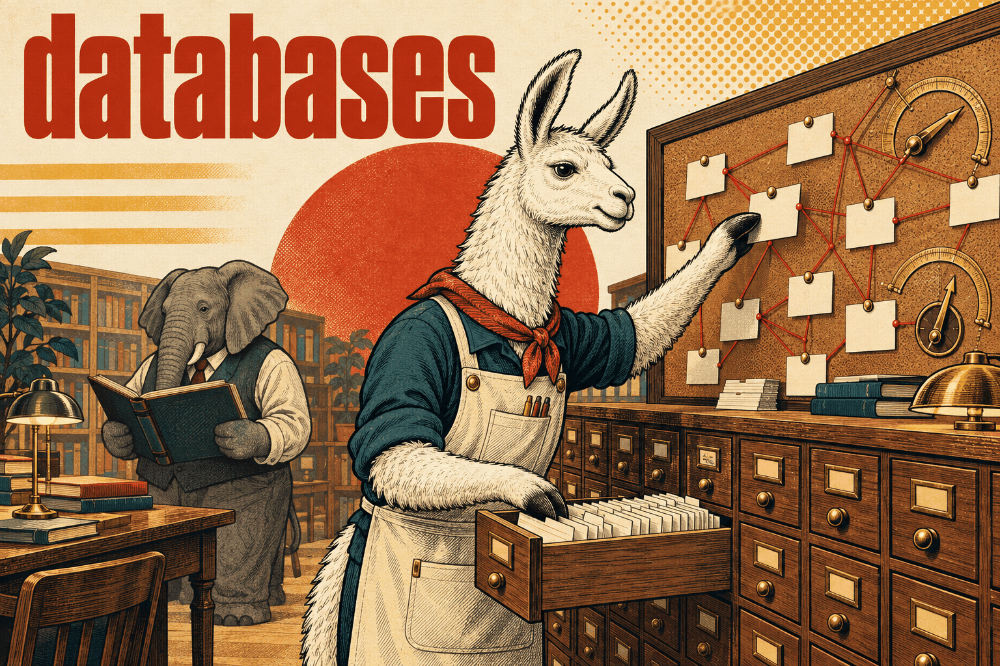

# Databases skills

Data stores and the engineering around them — schema, indexes, query plans,
consistency and recovery. Where a skill documents a language's database client,
the language group owns it; this group covers the database itself.

## [postgres-vector-graph](postgres-vector-graph/SKILL.md)

PostgreSQL 18 with pgvector and Apache AGE, alone and in combination. The default
it argues for is a relational system of record, typed vector columns and explicit
graph projections — and it says plainly not to add a graph merely because the
application uses an LLM.

The body is a working contract (discover versions first, pick the smallest useful
composition, make identities and tenant boundaries explicit, prove each property
separately, report evidence) plus a routing map into references on the PG18
baseline, HNSW/IVFFlat tuning, filtered ANN and candidate starvation, embedding
model migrations, AGE Cypher and agtype boundaries, hybrid FTS + vector fusion,
graph-first and vector-first retrieval, outbox consistency, and RLS for both SQL
and AGE label tables.

Its guardrails target the confusions that pass review: `ts_rank` is not BM25,
`strict_order` is not exact recall, HNSW's navigation graph is not the domain
graph, relational RLS does not protect AGE tables, and host parameters never go
inside a dollar-quoted Cypher body. It ships an offline lab (SQL examples,
templates, a retrieval-metrics script and its tests) and never installs
extensions, changes roles or runs production benchmarks on its own.

Licensed MIT (see its `LICENSE` and `THIRD_PARTY.md`), unlike the rest of this
library.

**Load when** designing, debugging, tuning or operating PostgreSQL with pgvector
and/or Apache AGE — vector search, filtered ANN, hybrid retrieval, graph queries,
or anything that crosses the SQL/vector/graph boundary.
