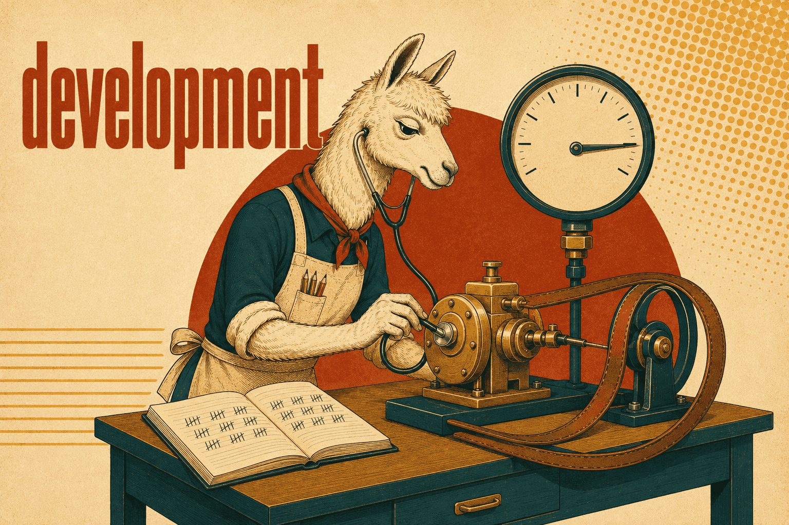

# Development skills

Engineering practice — disciplines that hold regardless of language or domain.
Where a skill documents a tool, the tool-specific groups (perl,
system-and-network-administration) own it; this group covers how to *do the work*,
not which tool to reach for.

## [feedback-loop-debugging](feedback-loop-debugging/SKILL.md)

A six-phase discipline for hard bugs, built on one claim: **the feedback loop is
the skill.** Given a fast, deterministic, agent-runnable pass/fail signal for the
bug, bisection and hypothesis-testing are mechanical. Without one, no amount of
staring at code helps — so the skill spends its weight on phase 1 and lists ten
ways to construct a loop, in escalating order from a failing test to a
human-in-the-loop script.

The remaining phases exist to stop the usual shortcuts: reproduce before
theorising, generate 3–5 *falsifiable* hypotheses before testing any of them (single
hypothesis generation anchors on the first plausible idea), instrument one variable
at a time with tagged debug output that can be grepped away afterwards, and write
the regression test before the fix — but only where a correct seam exists, because
a test at the wrong seam is false confidence. The post-mortem asks what would have
prevented the bug, deliberately *after* the fix is in.

For non-deterministic bugs the goal is stated as raising the reproduction rate, not
achieving a clean repro: a 50%-flake bug is debuggable, a 1% one is not.

**Load when** something is broken, throwing, failing or suddenly slow — before
proposing any fix.
