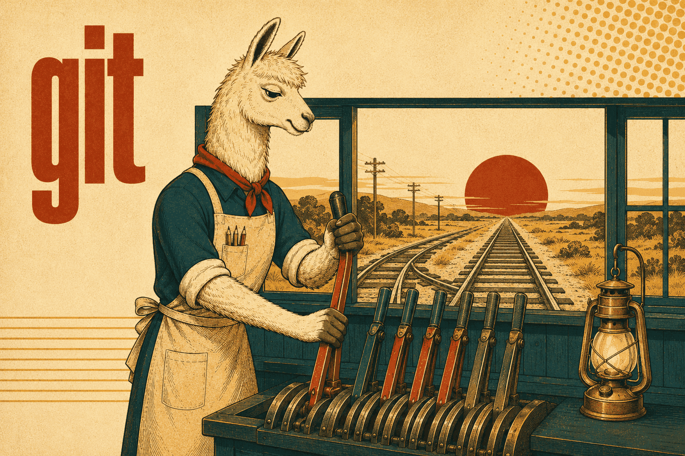

# Git skills

How Getty's repositories are used, and how their commit messages are written — two
different concerns kept as two skills so either can be loaded without the other.

## [getty-git-usage](getty-git-usage/SKILL.md)

Short version: **keep the history linear.** A branch lands rebased, not merged, and
a force-push after a rebase is always `--force-with-lease`.

Covers why squash-merging is the wrong default where a release is cut from commit
prefixes (squashing replaces the individual `feat:`/`fix:` subjects with the PR
title, and a PR title without a prefix cuts no release at all), how stacked branches
behave when the lower one lands — GitHub closes the dependent PR and refuses to
reopen it — and which conventional prefixes drive which version bump. Merge commits
are not forbidden, just not the default.

**Load when** landing a branch, cleaning up history before a PR, working with
stacked branches, or cutting a release.

## [getty-git-commit-style](getty-git-commit-style/SKILL.md)

The message format: an imperative summary line under ~72 characters, then a body
with one line per discrete change — no bullets, no prose, no "This commit…".

The rule that carries the most weight is completeness: every file-level change gets
named, nothing silently lumped together. State *what* changed, never why it matters
or how it works — the diff shows that. Includes the `@`-symbol trap (GitHub reads
`@word` as a user mention, so a bundle is written `[DBIO]`, never `[@DBIO]`), the
co-authorship trailer naming the model that actually did the work, and passing
messages via HEREDOC so the formatting survives the shell.

**Load when** writing or amending a commit message, including one that spans
several repos — each repo gets its own commit, with no cross-references.
