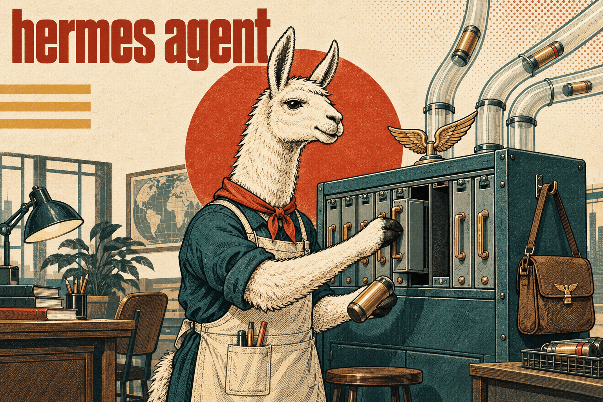

# Hermes Agent skills

Working with NousResearch [Hermes Agent](https://github.com/NousResearch/hermes-agent):
the agent itself, its messaging gateway, and the Desktop and Dashboard surfaces
around it. "Hermes" also names a model family and unrelated software — this group
is about the agent. A reference skill — nothing here is specific to one project.

## [hermes-plugin-engineering](hermes-plugin-engineering/SKILL.md)

Hermes has no single plugin API. A CLI run, the long-running messaging gateway, the
Desktop renderer, the Desktop backend, the web Dashboard, a cron process and an MCP
child are different runtimes, and an extension executes in exactly one of them —
sharing files gives them neither shared memory nor an event bus. General Python
plugins run trusted and in-process: capability grants guard particular host APIs,
they are not a sandbox.

Covers choosing the extension point — native tool or MCP server, session command,
observer hook, middleware, a provider (model, memory, context, media, browser,
terminal), platform adapter, native channel handler, Desktop or Dashboard
contribution — and the six steps that fail independently of each other: discover,
prepare dependencies, enable, register, expose, activate. Then the contracts that
surprise: request middleware returns a complete replacement and runs before the
approval boundary, a failing middleware callback is skipped rather than enforced,
and a raw Telegram callback is not an authenticated gateway command.

Gateway routing, Telegram and the other channels, permissions and secrets,
packaging, evaluation and troubleshooting fill the rest — 25 references, loaded one
decision at a time, on a dated source snapshot pinned to a commit. Recheck anything
version-sensitive against the target build.

**Load when** building or debugging a Hermes plugin, adapter, provider or
Desktop/Dashboard extension, or deciding whether a feature fits an extension point
or needs core work.
