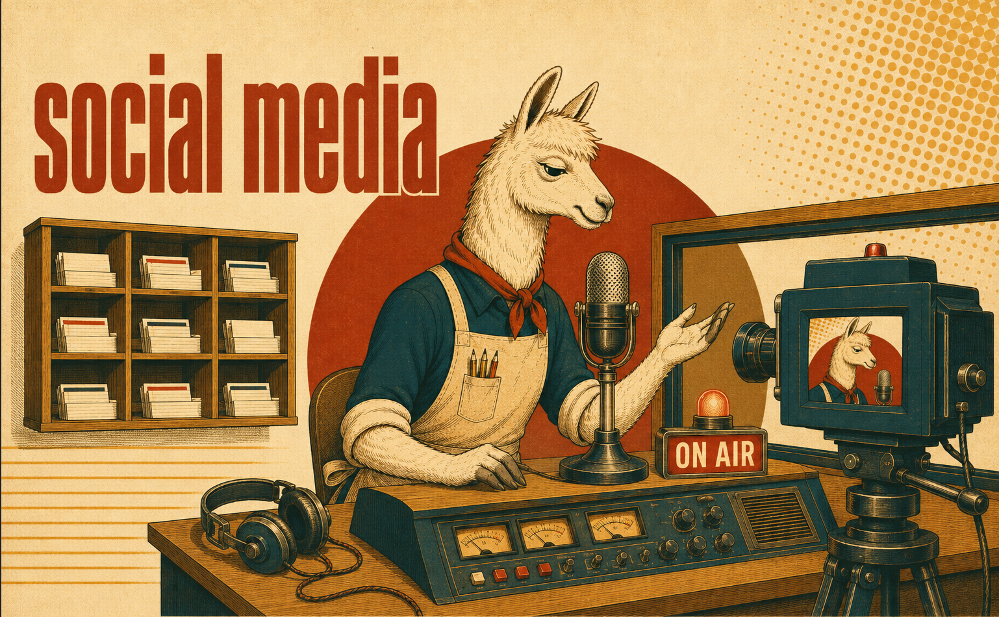

# Social media skills

Platform knowledge for the two creator platforms Getty publishes on. Both are reference
skills, not house conventions — they document how the platform behaves, which is equally
true for anyone using it.

What makes them worth carrying as skills rather than leaving to general knowledge is that
both platforms moved recently and both carry DACH duties with no US equivalent. The
jurisdiction files live **inside** each skill rather than beside it: a separate
`-germany` skill would be a second independent trigger, and the expensive failure is the
parent firing alone and advising a German user with no Impressum, no ad labelling and no
VAT threshold.

## [linkedin](linkedin/SKILL.md)

Formats and their limits, how distribution actually works, how to write something worth
distributing, and what a commercial account owes legally in DACH.

Three corrections it exists to make: reach is driven by whether a post reads as a story
or as an ad — not by format and not capped by follower count; the popular advice about
links in posts is genuinely contested in 2026 (sources span "−60 % reach" to "+236 %", so
the skill refuses to assert either and says to A/B it); and published format rankings
describe accounts that already have reach, so they routinely invert on a small one.

Covers profile and company pages, content strategy and post writing, engagement and
outreach, ads and Lead Gen, Sales Navigator, job search and recruiting, analytics, post
archives and account risks — plus DACH legal notice, GDPR joint controllership, ad
labelling, Du/Sie and gendering, member numbers and posting times.

**Load when** writing or editing a post, planning content strategy, optimising a profile
or company page, running outreach or ads, or analysing what an account published.

## [twitch](twitch/SKILL.md)

Channel operation end to end: encoder and OBS, discovery and growth, stream structure,
chat and community features, monetization, moderation, the Helix/EventSub APIs — and what
a streamer is legally required to do in DACH.

Two things it exists to prevent. **Stale monetization facts**: in May–June 2026 Twitch
opened subs, Bits, emotes, badges and Channel Points to all streamers and lowered the
Affiliate bar, and almost every guide online predates that. And **US-default legal
answers**: a regular livestream is *Rundfunk* under German law, with a licence threshold,
broadcast-grade youth-protection time slots and ad labelling duties that simply do not
exist in the US.

**Load when** setting up or auditing a channel, tuning encoder settings, planning growth
or a run of show, working with the Twitch API, or answering anything about payouts,
music rights, minors or advertising.
