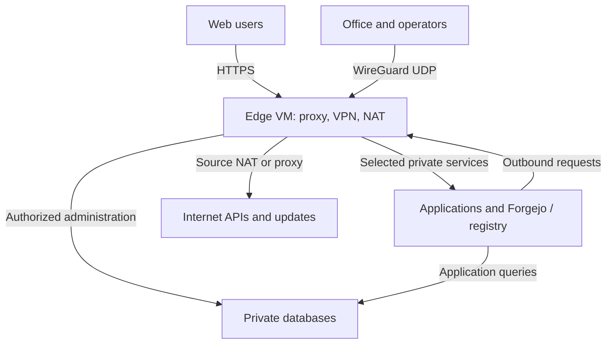

# Architecture recipes: one public address, private services, and availability

Read after identifying traffic requirements. These are original design recommendations, not managed-service guarantees. Provider boundaries were checked on **2026-10-04**; verify current prices, limits, locations, and IP lifecycle before deployment.

## Contents

- [Choose by traffic and failure requirements](#choose-by-traffic-and-failure-requirements)
- [Recipe A: one public IPv4 and a combined edge VM](#recipe-a-one-public-ipv4-and-a-combined-edge-vm)
- [Recipe B: managed web ingress and independent VPN](#recipe-b-managed-web-ingress-and-independent-vpn)
- [Recipe C: private connector to a headquarters hub](#recipe-c-private-connector-to-a-headquarters-hub)
- [Recipe D: encryption entirely inside Hetzner](#recipe-d-encryption-entirely-inside-hetzner)
- [Design availability as a set of dependencies](#design-availability-as-a-set-of-dependencies)
- [Implement in dependency order](#implement-in-dependency-order)

## Choose by traffic and failure requirements

| Requirement | Small reference design | Reason to move beyond it |
|---|---|---|
| Strictly one paid public IPv4, several HTTPS applications, office VPN, outbound access | One operated Cloud edge VM providing reverse proxy, WireGuard, and NAT | A single reboot or compromise affects all three traffic purposes |
| Managed public web ingress and private administration | Managed LB plus an independently reachable VPN/NAT VM | More endpoints/cost; still model gateway and database failures |
| Existing headquarters VPN endpoint; no inbound Hetzner VPN port | Private connector initiates through existing egress | Office reachability, NAT, and bootstrap remain dependencies |
| Encrypt traffic between already connected private VMs | WireGuard directly between those private addresses | Peer/identity management at larger scale; hub trust if relaying |
| Tolerate one gateway failure with a stated recovery objective | Two designed gateway paths, routing ownership, monitoring, and tested cutover | Coordination and session recovery need deliberate engineering |

Separate **one address users connect to** from **one allocated/billed address in the whole system**. Floating IP failover and managed web ingress may provide stable user-facing endpoints while retaining additional charged infrastructure. Read [public IPs](public-ips.md) and [cost](cost-capacity-lifecycle.md).

## Recipe A: one public IPv4 and a combined edge VM

Attach the edge VM to a Cloud Network. Put application and database VMs on private addresses. Use the edge's one public IPv4 for several protocols:

| Traffic | Edge function | Backend path |
|---|---|---|
| HTTPS to `app.example`, `git.example`, `registry.example` | Reverse proxy routes by hostname; manage TLS | Selected private service address/port |
| Office and administrator VPN | WireGuard UDP endpoint | Routed, explicitly authorized private destinations |
| Private server downloads and external LLM APIs | IPv4 source NAT or selected explicit proxy | Edge public uplink |
| Emergency SSH to the edge | Narrow temporary/operator source rule | Edge only |
| SSH to particular private servers | VPN or `ProxyJump` | Stable private host identity |
| Optional public Git-over-SSH | A dedicated public port with selected TCP forwarding | Forgejo SSH listener, not an arbitrary pool of SSH servers |

Example mapping: edge `10.70.1.2`, application `10.70.1.10`, database `10.70.1.11`, Network `10.70.0.0/16`, provider gateway `10.70.0.1`. A second database is a separate private address and an explicit replication/recovery design; do not expose it through the web proxy.

For egress in this **combined** design, the Cloud `0.0.0.0/0` route points to `10.70.1.2`, while private guests use the provider gateway as their OS next hop. The standalone NAT reference uses `.3` to illustrate a **separate** gateway; select the address matching the actual topology. Keep remote VPN/HQ prefixes routed as described in [WireGuard](wireguard-site-to-site.md).

Combine the intended forwarding rules under one coherent firewall owner. **Do not load both sample default-drop forward tables unchanged:** an accept in the VPN table cannot override a later drop in the independent NAT table. Add the specific VPN-to-private and private-to-public permissions to the gateway's selected policy, with established replies and separate source-NAT rules. Add public TCP 443, and TCP 80 only if required by the chosen redirect/ACME flow, to the proxy's INPUT policy; the VPN-only asset does not open these listeners. Treat application proxy listeners, forwarded traffic, and gateway management as separate rule paths. [nftables chain behavior](https://wiki.nftables.org/wiki-nftables/index.php/Configuring_chains).

Use application TLS and authentication for Forgejo/registry. Define upload size, streaming timeout, client source trust, storage, and consistent backup requirements. A reverse proxy is not application replication. If the edge hosts Docker, inspect Docker's forwarding/NAT integration before assuming host INPUT rules protect published ports. [Docker firewall documentation](https://docs.docker.com/engine/network/packet-filtering-firewalls/).

For a modest deployment that accepts gateway maintenance downtime, this is a reasonable starting design. Size from throughput, packet rate, TLS work, tunnel encryption, and connection count. The gateway becomes a concentrated administrative and availability dependency; keep its purpose narrow and recovery reproducible.

## Recipe B: managed web ingress and independent VPN

Use a managed Load Balancer for public web requests and private application targets. Keep an independently reachable VPN endpoint for operators, plus general egress where private nodes need it. VPN and NAT may initially share a small VM; separate them when their availability or trust requirements differ.

The managed LB does not carry arbitrary UDP or serve as a NAT router. In HTTPS termination mode the backend hop is HTTP; choose TCP passthrough to application TLS terminators if backend encryption is required. For hostname routing to unrelated applications, supply an application reverse proxy behind the LB. [LB FAQ](https://docs.hetzner.com/networking/load-balancers/faq/).

Document three independent health questions: can public users reach a ready application, can administrators reach private hosts, and can private nodes reach required external services? A healthy web LB says nothing about the last two. Keep registry/API dependency checks out of an excessively broad readiness check that would unnecessarily take every replica down.

This design usually has more than one public endpoint. Do not promise a one-IPv4 bill when adding an IPv4 VPN server beside a managed LB. For current LB public-IP billing and retention, inspect the [announced IP transition](https://docs.hetzner.com/networking/load-balancers/overview/) and the live API before assuming addresses survive replacement.

## Recipe C: private connector to a headquarters hub

Use this when the organization already operates a reachable hub and wants a Hetzner-side peer to initiate. The Hetzner connector can have only a private address **if a different working component supplies its outbound route**. Preinstall/configure the tunnel or provide bootstrap egress. Keep the office endpoint reachable outside the tunnel to avoid a recursive dependency.

If a separate NAT VM already exists, send the connector's outer UDP through it. Use keepalive on the initiating peer if its upstream NAT requires it. Keep private Cloud routes for the remote office prefixes pointed to the connector, and use the proper provider gateway in application guest routes. Select routed source preservation or deliberate SNAT; do not accidentally combine policies copied from different examples.

Alternative arrangements include direct public IPv6 transport where every peer supports it, an approved mesh relay, or a separately routed private connection. State their address reachability and egress dependencies explicitly. A server with public IPv6 is not fully private-only, and raw WireGuard does not automatically provide a TCP relay for a UDP-blocked uplink.

Check loss of the office uplink and hub: decide whether only administration, or also package/API/backup traffic, should fail. Avoid routing all Internet egress through headquarters unless policy, cost, or network control justifies that dependency.

## Recipe D: encryption entirely inside Hetzner

Use private addresses as WireGuard UDP endpoints and distinct overlay addresses for applications. Already provisioned private machines need no public VPN server for this packet path. Keep overlay routes from swallowing the private endpoint routes. Read [internal WireGuard](vpn-inside-private-network.md) for reciprocal configurations and firewall requirements.

Choose direct peers for a few machines or a managed enrollment policy for larger deployments. If a hub relays decrypted inner packets into another tunnel, the hub remains a trusted plaintext termination point. Use application TLS when identity or confidentiality must extend beyond that intermediary.

## Design availability as a set of dependencies

| Failure to tolerate | Additional design required |
|---|---|
| Application process/VM loss | Ready replicas, appropriate load distribution, shared or replicated state |
| Gateway VM loss | Alternate endpoint/tunnel, private-route ownership, configuration, health decision, fencing |
| Stateful NAT failover | Stable egress identity if needed, state strategy or reconnecting clients, measured interruption |
| Database loss | Replication/failover semantics, independent backup/PITR, tested restore and client reconnection |
| Location loss | Available compute/storage in another location, latency and consistency decisions, DNS/cutover plan |
| Control-plane outage | Existing data-path behavior and a recovery method that does not assume successful API mutation |
| Credential compromise or accidental deletion | Independent credentials, constrained deletion, recovery copies outside that credential's reach |

A Cloud Floating IP move alone does not change private Network routes or transfer guest configuration and connection state. Floating IPv4 also requires suitable Primary IPv4 connectivity on receiving servers; account for those retained addresses. Do not assume Ethernet VRRP/CARP moves a Hetzner routed Network gateway. [Floating IP FAQ](https://docs.hetzner.com/cloud/floating-ips/faq/), [Network architecture](https://docs.hetzner.com/networking/networks/technical-concepts/architecture/).

For a two-node database design, explicitly resolve quorum/witness, split-brain fencing, replication mode, acceptable data loss, and operator recovery. Two machines alone do not establish automatic safe failover. If recovery time can tolerate rebuilding a small gateway, a simple measured rebuild process can be more maintainable than an untested HA controller.

## Implement in dependency order

1. Choose non-overlapping addresses and explicit allowed flows; inventory existing policy and resource ownership.
2. Build management and gateway access, credentials, recovery console, and initial private routing.
3. Establish bootstrap egress or prepared images; verify DNS, downloads, and required endpoints.
4. Configure VPN/office paths and host access rules, then test permitted and denied connections.
5. Build storage, backup destinations, applications, and coherent restoration procedures.
6. Add public ingress and certificates; verify the actual hostnames and private backend path before changing DNS.
7. Measure normal behavior, verify persistence, then test the specific failover or restoration objective when authorized.

Keep acceptance evidence tied to the requirement: service access, source identity, denial, persistence, backup restoration, measured load, and recovery duration. Offline topology validation covers only its documented subset; it does not establish these operational outcomes.
