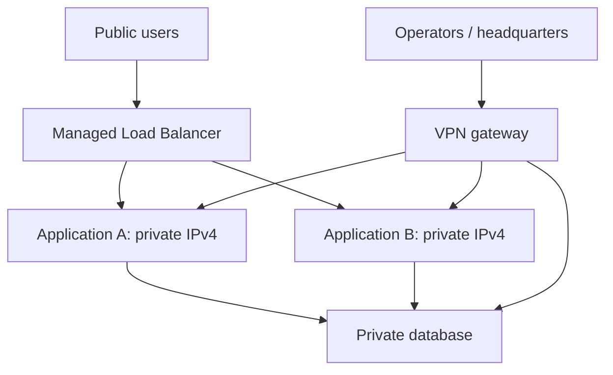

# Managed Load Balancers and private application targets

Evidence snapshot: 2026-10-04. Provider behavior is linked; workflows are reference designs. Recheck the announced 2026-10-05 IP transition before provisioning.

## Contents

- [Service boundary](#service-boundary)
- [Targets and protocols](#targets-and-protocols)
- [TLS and client identity](#tls-and-client-identity)
- [Reference architecture](#reference-architecture)
- [Health and operation](#health-and-operation)
- [Availability and address lifecycle](#availability-and-address-lifecycle)

## Service boundary

A managed Load Balancer publishes an application endpoint backed by private servers. Outbound egress and administrative access require separate NAT/proxy and VPN/bastion paths.

Supported services are TCP, HTTP, and HTTPS, not UDP. WireGuard needs a separate UDP endpoint. [Product capabilities](https://www.hetzner.com/cloud/load-balancer/). Public IPv4/IPv6 frontends use IPv4 targets. [Overview](https://docs.hetzner.com/networking/load-balancers/overview/).

For the question “Can everything sit behind one public IP?”, first enumerate protocols:

| Workload | Reference placement |
|---|---|
| Public web application | Managed LB to private application instances |
| Several web domains with different applications | Application reverse proxy behind the LB, with explicit hostname routing |
| Private database administration | VPN or SSH tunnel |
| Site-to-site WireGuard | Public Cloud VPN gateway |
| Outbound API calls from private VMs | NAT gateway or explicit proxy |
| UDP service with public users | Operated UDP-capable gateway/service design |

A small installation can combine reverse proxy, WireGuard, and NAT on one VM, joining their maintenance/failure domains. A managed LB plus VPN/NAT VM normally has distinct public endpoints.

## Targets and protocols

The [creation guide](https://docs.hetzner.com/networking/load-balancers/getting-started/creating-a-load-balancer/) supports Cloud server/label and eligible dedicated-server targets. Attach private targets to the LB's Network and select private addressing explicitly.

Targets must share the LB's network zone; IP-based targets require `eu-central`. [Location restrictions](https://docs.hetzner.com/cloud/general/locations/). Dedicated targets have Robot ownership/vSwitch-subnet requirements; check the [FAQ](https://docs.hetzner.com/networking/load-balancers/faq/) before deployment.

Useful service choices:

| Listener mode | Client to LB | LB to backend | Use |
|---|---|---|---|
| HTTP | HTTP | HTTP | Plain HTTP endpoint or redirects |
| HTTPS | TLS terminates at LB | HTTP | Managed edge TLS termination |
| TCP on 443 | TLS bytes pass through | Backend terminates TLS | End-to-end TLS or application-controlled TLS |

HTTPS service mode does not re-encrypt traffic to the backend; TCP passthrough is the documented alternative. HTTPS health checks are a separate capability. [Protocol behavior](https://docs.hetzner.com/networking/load-balancers/faq/).

## TLS and client identity

For an encrypted private hop, select TCP passthrough to TLS-capable targets. Coordinate certificate renewal, SNI, and readiness with the TLS terminator.

HTTP(S) services supply `X-Forwarded-For`, `X-Forwarded-Port`, and `X-Forwarded-Proto`. TCP services can convey client identity through PROXY protocol, which the backend must explicitly understand. Enabling it against an incompatible listener breaks that service. [Header and PROXY behavior](https://docs.hetzner.com/networking/load-balancers/faq/).

Trust forwarding headers only from the actual proxy path; normalize untrusted headers. Bind backends to intended addresses, restrict guest ports to intended callers/health checks, and test redirects and secure cookies.

Cloud Firewalls cannot protect LBs or their private backend path; use guest/application policy. [Firewall FAQ](https://docs.hetzner.com/cloud/firewalls/faq/).

## Reference architecture

Use Network `10.70.0.0/16`, Cloud subnet `10.70.1.0/24`, LB `10.70.1.5`, and applications `10.70.1.10` / `10.70.1.11`. Reserve VPN VM `10.70.1.2` and optional NAT VM `10.70.1.3` independently.

Targets should implement the same listener contract. Route application hostnames inside the proxy layer. Do not balance unrelated SSH hosts when operators need a particular VM.

A private-only LB is also possible: the official [Python SDK](https://hcloud-python.readthedocs.io/en/latest/api.clients.load_balancers.html) exposes public-interface disabling and Network attachment. Check current API preconditions, use private targets, and test from an authorized private/VPN client before disabling public reachability. This supports an internal service endpoint; it does not establish VPN transport by itself.

## Health and operation

Reference rollout:

1. Deploy backend listeners and a dedicated readiness path. A TCP accept check only proves a socket exists; decide what application readiness must mean.
2. Attach and verify the Network; add a single private target first. Test the listener directly from a trusted private VM.
3. Configure the intended service, target port, certificate behavior, and health check.
4. Exercise the public endpoint with the real hostname, TLS, login flow, WebSocket/SSE or long requests where relevant.
5. Add the second target, verify both receive representative requests, then test one target becoming unready.
6. Publish/adjust DNS only after the endpoint works. Keep old targets available until rollback and long-lived connection behavior are understood.

Log requests at targets/proxies and keep a shared request identifier. Monitor readiness, latency, statuses, connections, and resource pressure. Hetzner does not retain per-request LB logs. [FAQ](https://docs.hetzner.com/networking/load-balancers/faq/).

| Symptom | Next check |
|---|---|
| All targets unhealthy | Target port, health path/Host/TLS, private selection, guest firewall |
| TLS fails after enabling PROXY protocol | Backend parser and listener configuration |
| Redirect loop or insecure cookies | Forwarded scheme and trusted-proxy settings |
| Works by private IP, fails through LB | Service mode, protocol framing, certificate/SNI, readiness |
| New replica never receives traffic | Label target membership, readiness, session affinity, long-lived connections |
| Private VM cannot download packages | Its outbound route/NAT/proxy; the LB is unrelated |

## Availability and address lifecycle

Managed hardware failover can briefly interrupt service. [Availability](https://docs.hetzner.com/networking/load-balancers/faq/). Design application/database recovery separately. Size against measured connections and workload, not an assumed bandwidth guarantee.

The [overview](https://docs.hetzner.com/networking/load-balancers/overview/) announces public addresses becoming separately displayed/invoiced Primary IPs on 2026-10-05, with a Primary IPv4 included in advertised LB pricing. Do not infer new assignment or retention semantics from this billing notice. Review the current contract before replacing an LB or assuming an address will survive its deletion; see [public IP lifecycle](public-ips.md).
