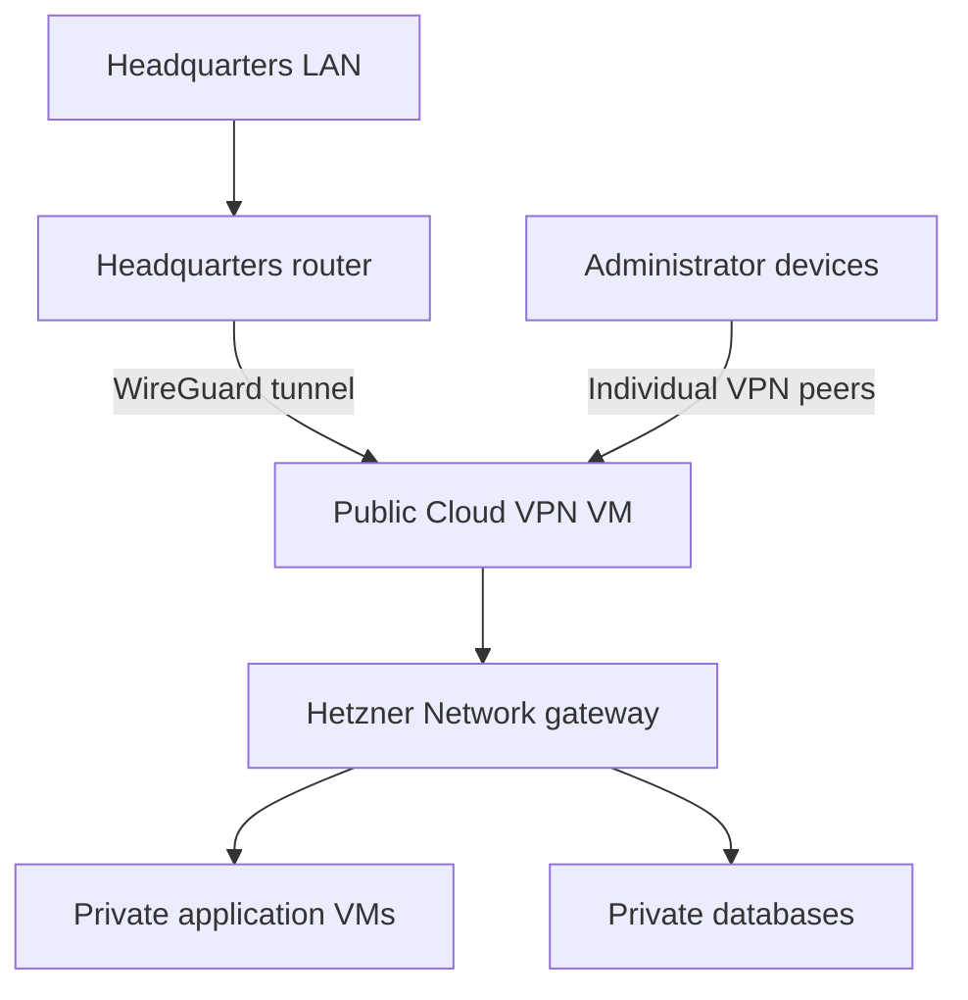

# VPN and administrative access to private Hetzner servers

Evidence snapshot: 2026-10-04. This module recommends architectures and operating decisions; it does not claim Hetzner supplies a managed VPN. Provider and upstream behavior is cited. For the complete worked configuration, load [WireGuard site-to-site](wireguard-site-to-site.md) after choosing the topology here.

For encryption solely between already connected private Hetzner machines, use [internal WireGuard](vpn-inside-private-network.md). That scenario does not require this module's public headquarters-access hub.

## Contents

- [Default architecture](#default-architecture)
- [Select the access method](#select-the-access-method)
- [Routed VPN versus source NAT](#routed-vpn-versus-source-nat)
- [Private gateway initiating outward](#private-gateway-initiating-outward)
- [Tailscale and managed mesh alternatives](#tailscale-and-managed-mesh-alternatives)
- [Bastion and console recovery](#bastion-and-console-recovery)
- [Gateway operations and availability](#gateway-operations-and-availability)

## Default architecture

For a headquarters LAN plus several private Cloud servers, the reference default is **a small public Cloud VM running WireGuard, attached to the application's private Network**. Headquarters initiates its tunnel to this stable endpoint. Private workloads use private addresses; they do not need individual public IPs to exchange traffic through the VPN.

Use `10.70.0.0/16` as the example Network, subnet `10.70.1.0/24`, provider gateway `10.70.0.1`, VPN VM `10.70.1.2`, private application `10.70.1.10`, VPN addresses `10.77.0.0/24`, and headquarters LAN `192.168.50.0/24`. These are placeholders, not assumptions about the user's existing network.



The provider gateway address follows the **Network prefix**, even when the Cloud subnet is `10.70.1.0/24`. Confirm the actual attachment and guest routes rather than substituting the VPN VM as an on-link router. See [Cloud networking](cloud-networking.md).

Expose the VPN transport deliberately and keep its administration restricted. Application HTTPS can use a separate managed Load Balancer. Its supported [TCP/HTTP/HTTPS protocols](https://www.hetzner.com/cloud/load-balancer/) do not include the UDP transport needed by WireGuard.

## Select the access method

| Method | Best fit | Principal tradeoff |
|---|---|---|
| Public WireGuard hub plus private NIC | Fixed headquarters route, self-operated infrastructure | Own peer keys, routing, firewall, updates, and recovery |
| Private WireGuard VM initiating to a reachable headquarters endpoint | Policy requires no public interface on VPN VM | Existing egress/NAT is required before tunnel establishment |
| Tailscale subnet router | Multiple users/devices and identity-based access | External coordination/identity dependency and policy administration |
| Per-node mesh clients | Device-level identity and direct overlay paths | Client software and outbound bootstrap on every node |
| SSH ProxyJump bastion | A few SSH/administration tasks | No general LAN routing; per-service tunnels when needed |
| Router appliance such as OPNsense/pfSense | Team already operates that appliance | More moving parts; Hetzner routed-NIC behavior still applies |

A public IPv6 endpoint can replace public IPv4 only if every required peer can reach it. A public WireGuard VM is itself public even when all business services are private. Separating that VM from registry, database, and frontend workloads makes its routing and security boundary easier to inspect.

## Routed VPN versus source NAT

Choose source-address semantics before writing firewall rules:

| Design | What the private application sees | Required return-path design |
|---|---|---|
| Routed VPN | Real headquarters or VPN-client source IP | Cloud prefix routes, guest routes, and remote LAN routes |
| VPN source NAT to `10.70.1.2` | Gateway's private IP | Return through the gateway's connection state |

Hetzner validates source prefixes using fabric **uRPF**. Forwarded headquarters/VPN sources need a Cloud route pointing back to the VPN VM, or source NAT. A source prefix is not authorized merely by adding it inside Linux. [Provider uRPF behavior](https://docs.hetzner.com/networking/networks/faq/).

For the routed example, configure these exact responsibilities:

| Place | Required intent |
|---|---|
| Hetzner Network route | `192.168.50.0/24` via `10.70.1.2` |
| Hetzner Network route | `10.77.0.0/24` via `10.70.1.2`, when remote peers use this pool |
| Application VM route | Both external prefixes via provider `10.70.0.1` |
| VPN VM | Private Network via provider; headquarters prefix via its WireGuard peer |
| Headquarters | Cloud prefix via its local VPN router; matching peer routing |
| All forwarding points | Permit only intended source, destination, and service combinations |

If the headquarters VPN process runs on a machine other than the LAN's normal gateway, add the Cloud route on that normal gateway as well. A successful tunnel between two endpoints does not teach other LAN devices where replies belong.

Prefer routed access when applications need per-device source logging and explicit network policy. Prefer narrow source NAT when administrators cannot add return routes or source attribution is provided at another layer. SNAT simplifies access but concentrates identity at the gateway and requires stateful return traffic. It does not solve overlapping address spaces automatically.

Linux `rp_filter` is separate from provider uRPF. Inspect its per-interface and `all` values when asymmetric routing is suspected; strict validation can reject legitimate packets. Fix routes first. If justified, use the narrowest appropriate loose-mode change; the kernel uses the maximum of `all` and the interface setting. [Linux source-validation documentation](https://docs.kernel.org/networking/ip-sysctl.html). Changing this setting cannot disable Hetzner's fabric checks.

## Private gateway initiating outward

A private-only VPN VM may initiate WireGuard through another NAT VM to a public headquarters endpoint. This is useful when the tunnel's reachable endpoint belongs at headquarters. It does not remove the need for Internet transport: the private VM still needs a working default route, translation, DNS where used, and allowed outbound UDP. See [private egress](private-egress-nat.md).

Avoid the circular dependency “the VPN supplies the only egress needed to start the VPN.” Establish the transport route independently, and keep the remote endpoint reachable outside the inner tunnel routes. A headquarters site behind CGNAT with no reachable inbound endpoint usually fits the public Hetzner hub better.

WireGuard's optional persistent keepalive can maintain a NAT mapping for a peer that must receive traffic while idle. Enable it when the topology needs it, not indiscriminately on every peer. [WireGuard quick start](https://www.wireguard.com/quickstart/).

## Tailscale and managed mesh alternatives

A subnet router advertises the Cloud prefix to authorized tailnet clients; per-node clients instead give individual machines overlay identities. Tailscale subnet routers use source NAT by default, while route approval and traffic authorization are distinct controls. Disabling SNAT requires the routed return design above. [Tailscale subnet-router documentation](https://tailscale.com/docs/features/subnet-routers).

An installed agent is not a substitute for initial connectivity. Private nodes need access to the required coordination/relay endpoints through established egress; test DNS and relay behavior under the intended firewall rules. With a single subnet router, measure its real data path and capacity rather than assuming all traffic is direct.

Restrict advertised prefixes and allowed services; do not grant the whole Network to every tailnet user by default. Plan device enrollment, offboarding, key expiry, administrator recovery, and the behavior during a control-plane outage. A subnet router offers access to selected networks; an exit node changes Internet egress and is a separate choice. [Tailscale routing distinctions](https://tailscale.com/docs/features/subnet-routers).

## Bastion and console recovery

For SSH-only access, use a public bastion in the same Network. Hetzner documents [private-IP SSH and ProxyJump](https://docs.hetzner.com/cloud/servers/getting-started/connecting-via-private-ip/). This original local client configuration keeps the private key on the operator's device:

```sshconfig
Host cloud-bastion
    HostName 203.0.113.10
    User operator
    IdentityFile ~/.ssh/hetzner_operator
    IdentitiesOnly yes
    ForwardAgent no

Host private-app
    HostName 10.70.1.10
    User operator
    ProxyJump cloud-bastion
    IdentityFile ~/.ssh/hetzner_operator
    IdentitiesOnly yes
    ForwardAgent no
```

Provision the `operator` account and its authorized public key on both hosts first; substitute the actual bastion address. Validate host-key fingerprints through a trusted channel. ProxyJump does not require copying the operator's private key to the bastion. See [OpenSSH configuration semantics](https://man.openbsd.org/ssh_config#ProxyJump).

Test browser console login while networking still works. The [console guide](https://docs.hetzner.com/cloud/servers/getting-started/vnc-console/) describes root-password login and reset. Console access is an emergency local-session path, not a general VPN into the Network. Private-only servers lack the separate Rescue System according to the [server FAQ](https://docs.hetzner.com/cloud/servers/faq/); do not plan recovery around a rescue SSH session that this configuration cannot provide.

## Gateway operations and availability

Run one configuration owner for WireGuard. Hetzner's [WireGuard App](https://docs.hetzner.com/cloud/apps/list/wireguard/) includes a UI that rewrites `wg0.conf` and triggers a restart when applied. Its Caddy/UI update procedures are separate from normal package upgrades. Either operate the image's management model or deliberately take over configuration ownership.

Keep an inventory of peer public keys, authorized prefixes, owner, and revocation date. Protect private keys, restrict any UI, and treat access to the gateway as access to its permitted downstream routes. Independently restrict databases and administrative services. Revoke one peer in a rehearsal and verify that a new connection is rejected.

Validate in increasing scope: tunnel handshake; gateway tunnel address; private gateway address; application TCP connection; headquarters-to-Cloud return path; reverse initiated flow if needed; large transfers; reboot; peer removal. Packet captures at WireGuard and the private NIC should reveal where source addresses change. A recent handshake proves only the transport.

For availability, choose explicitly between a simple rebuild objective and two independently reachable gateways. A movable Cloud Floating IP can preserve an endpoint only with compatible Primary IPs, guest configuration, and failover control; it does not move private routes or synchronize VPN/NAT state. See [public IPs](public-ips.md). Test fencing, API failure, route convergence, peer reconnection, and rollback before calling the system highly available.

Avoid placing the failover controller exclusively behind the gateway it must recover. Maintain a console recovery procedure and independently reachable monitoring. For a small team, documented restoration plus a spare prepared VM can be more dependable than an untested cluster of routers.
